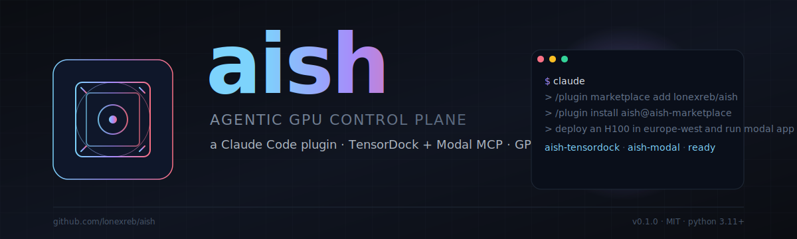

<p align="center">
  
</p>

<p align="center">
  <a href="https://github.com/lonexreb/aish/blob/main/LICENSE"></a>
  
  
  
</p>

# aish

> **Agentic GPU cloud control plane for Claude Code.** Provision, run, and tear down GPU workloads on TensorDock and Modal — without leaving your terminal — through MCP servers, skills, and subagents that ship together as one Claude Code plugin.

`aish` is the consolidation of three earlier prototypes ([AIsh](https://github.com/lonexreb/aish-legacy), [AIsh-v0](https://github.com/lonexreb/AIsh-v0), and [gpu-cloud-mcp](https://github.com/lonexreb/gpu-cloud-mcp)) into one polished, secure, openly-licensed plugin built to be accepted into the [official Anthropic plugin marketplace](https://github.com/anthropics/claude-plugins-official).

---

## What it gives you inside Claude Code

| Surface | What it does |
| --- | --- |
| **`aish-tensordock` MCP** | 10 tools for raw GPU VMs — `list_locations`, `list_hostnodes`, `list_instances`, `get_instance`, `deploy_instance`, `start_instance`, `stop_instance`, `modify_instance`, `delete_instance`, `get_ssh_command`. Hits TensorDock REST API v2 via `httpx`. |
| **`aish-modal` MCP** | 18 tools for serverless GPU apps — `list_apps`, `deploy_app`, `run_app`, `stop_app`, `app_logs`, `shell`, `list_containers`, `list_volumes`, `create_volume`, `volume_ls/put/get`, `delete_volume`, `list_secrets`, `create_secret`, `list_environments`, `check_config`, `open_dashboard`. Wraps the `modal` CLI via `asyncio` subprocess. |
| **`/aish:status`** slash command | One-shot health check across both providers. |
| **`/aish:deploy-gpu`** slash command | Guided GPU provisioning workflow. |
| **`/aish:modal-run`** slash command | Run a Modal function with a one-line description. |
| **`/aish:hf-setup`** slash command | Plan a HuggingFace model/dataset environment without deploying. |
| **`gpu-detect`** skill | Detect local GPU (NVIDIA / Apple Silicon / simulated fallback), CUDA capability lookup. |
| **`hf-env-setup`** skill | Set up a HuggingFace model/dataset environment with the right CUDA + framework. |
| **`gpu-operator`** subagent | Specialist for cost-optimal provisioning, hostnode selection, capacity planning. |
| **`ml-env-setup`** subagent | Specialist for environment bring-up, framework version pinning, and verification. |

---

## Install

> Requires Claude Code, Python 3.11+, and credentials for whichever provider(s) you use.

### From this marketplace (recommended)

```text
/plugin marketplace add lonexreb/aish
/plugin install aish@aish-marketplace
```

Restart Claude Code so the bundled MCP servers boot.

### From the official Anthropic marketplace

Once accepted, this plugin will be installable as:

```text
/plugin install aish@claude-plugins-official
```

### Local development clone

```bash
git clone https://github.com/lonexreb/aish.git
cd aish
python3 -m venv .venv && source .venv/bin/activate
pip install -e ".[dev,modal]"
modal setup        # one-time, browser-based
```

---

## Configure

aish reads credentials from environment variables only — no token ever lives in the repo or in `plugin.json`.

| Variable | Required by | How to get it |
| --- | --- | --- |
| `TENSORDOCK_API_TOKEN` | `aish-tensordock` | [dashboard.tensordock.com/developers](https://dashboard.tensordock.com/developers) |
| `AISH_LOG_LEVEL` | both (optional) | `DEBUG` / `INFO` / `WARNING` / `ERROR`. Defaults to `INFO`. |
| Modal auth | `aish-modal` | Run `modal setup` once. CLI handles `~/.modal/config.yaml`. |

**Recommended placement:** put `TENSORDOCK_API_TOKEN` in your `~/.claude/settings.json` `env` block so it scopes to Claude Code only:

```json
{
  "env": {
    "TENSORDOCK_API_TOKEN": "tdk_..."
  }
}
```

---

## Usage examples

### Provision an H100 in Europe

```text
> /aish:deploy-gpu
What kind of workload? "training a 7B model for one night"
Region preference? "europe-west, lowest hourly cost"
```

The `gpu-operator` subagent calls `aish-tensordock.list_locations` filtered by `H100`, ranks by hourly cost, then calls `deploy_instance` with sane defaults and surfaces the SSH command.

### Run a Modal function

```text
> /aish:modal-run "fine-tune sentence-transformers/all-MiniLM-L6-v2 on /data/queries.jsonl"
```

The `ml-env-setup` subagent generates the Modal app spec, the `aish-modal.deploy_app` tool publishes it, and `aish-modal.run_app` invokes it with the dataset.

### Inspect what you have running

```text
> /aish:status
```

Lists current TensorDock instances and Modal apps with cost/runtime, no extra prompting.

---

## Security & privacy

aish is built to the [STOP-SHIP security checklist](./ANTHROPIC-PLUGIN.md#stop-ship-security-checklist) before every release.

- **No `shell=True` anywhere.** All subprocess calls use `asyncio.create_subprocess_exec` with list-form `argv`.
- **Bearer tokens are redacted** in every error path; they never echo into the model context.
- **Strict input validation** at every MCP tool boundary — UUIDs are regex-checked, paths are resolved and re-checked against an allowlist, numeric ranges are enforced.
- **Hard timeouts** on every HTTP call (30/60s) and every subprocess (120-600s with `proc.kill()` + `await proc.wait()` on timeout).
- **No `PreToolUse` hooks that mutate input.** No `SessionStart` side effects. Install is side-effect-free.
- **Pinned dependencies** with hashes; CI runs `pip-audit` and `bandit` on every PR.

Full security model: [`ANTHROPIC-PLUGIN.md`](./ANTHROPIC-PLUGIN.md). Disclosure policy: [`SECURITY.md`](./SECURITY.md).

What data leaves your machine:
- TensorDock tool calls → `https://dashboard.tensordock.com/api/v2/*`
- Modal tool calls → whatever the `modal` CLI contacts (Modal control plane only)
- Nothing else. No telemetry, no analytics.

---

## Project docs

| File | Purpose |
| --- | --- |
| [`PLAN.md`](./PLAN.md) | Phased roadmap, milestones, and acceptance criteria. |
| [`ANTHROPIC-PLUGIN.md`](./ANTHROPIC-PLUGIN.md) | Best practices and security checklist for marketplace acceptance. |
| [`CLAUDE.md`](./CLAUDE.md) | Working agreement for Claude Code agents working in this repo. |
| [`SECURITY.md`](./SECURITY.md) | Vulnerability disclosure policy. |
| [`CONTRIBUTING.md`](./CONTRIBUTING.md) | How to file issues, propose changes, and run tests. |
| [`docs/PRIOR-ART.md`](./docs/PRIOR-ART.md) | What was carried over from AIsh, AIsh-v0, and gpu-cloud-mcp. |

---

## License

[MIT](./LICENSE) © 2026 Shubhankar Tripathy. Forks and contributions welcome.
